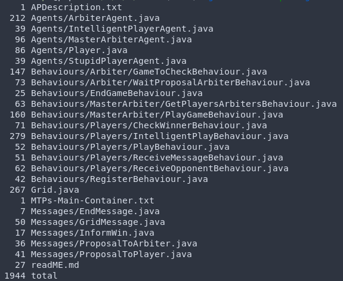
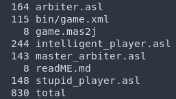
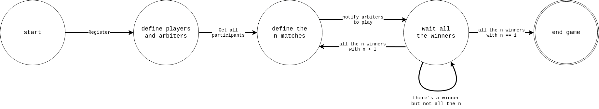
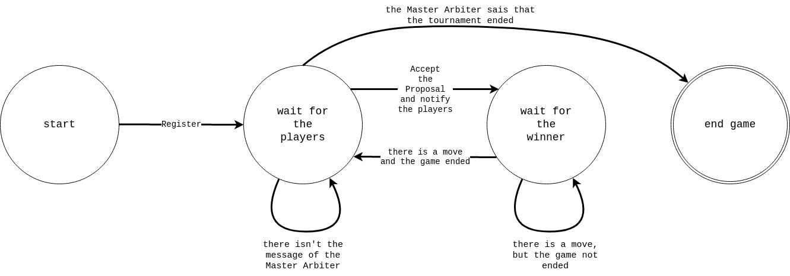
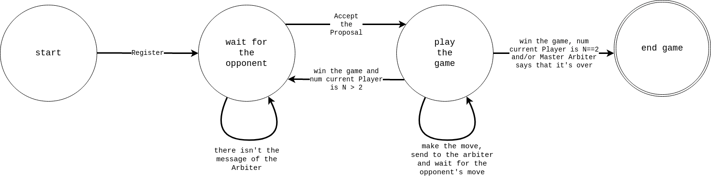
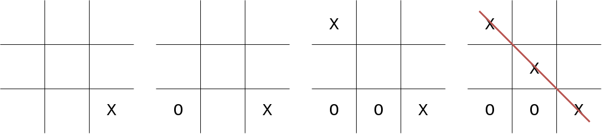
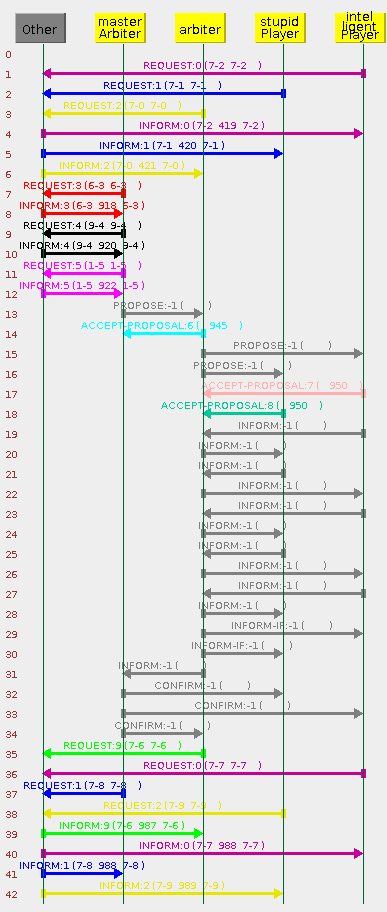
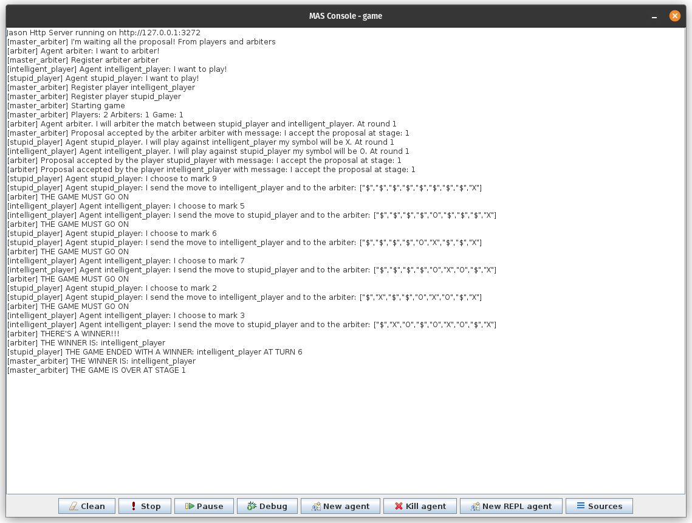

# TicTacToeMultiAgentSystem


A multi-agent, infinitely scalable, system where agents compete in tic-tac-toe tournaments.
The implementation was made in two different languages: Jade and Jason.

The following two sections are made for the purpose of showing that, with the same multi-agent system,
Jade requires twice as much code as Jason.

## Jade

Java Agent Development Framework with:

- 4 possible agents
- 11 behaviours
- 5 possible messages

### Lines of code: Jade



## Jason

A Java-based interpreter for an extended version of AgentSpeak with:

- 4 possible agents

### Lines of code: Jason



## Tournament

For each tournament, _3_ different types of agents are created:

- **Master Arbiter**: 1 master arbiter who organizes all the games by choosing the two players and the arbiter who controls the progress of the game. After all the matches of one round, he rearranges the winners so that they can compete against each other until there is only one left;
- **Arbiter**: if $N$ is the number of players, at least $\frac{N}{2}$ Arbiters must be defined. At each turn they check whether or not there is a winner in their game, if so they notify the Master Arbiter, if not, they continue the game. If there is a tie, they repeat the game;
- **Player**: the number $N$ of players must be a power of two in order to have an even number of players for each round and pairs that can always be built. We can actually define two different types of Players:
  - **Stupid Player**: chooses the move randomly;
  - **Intelligent Player**: if he has the chance to win he catches it and if he succeeds he avoids making the opponent win. If he is the first to make the move, he always chooses a corner, otherwise the central cell.

## Agent Description

Here is the description of the agents:

### Master Arbiter

The Master Arbiter is the one who organizes the tournament and it creates the matches. After waiting for all players and arbiters to register, proceed as follows:

1. Register himself and creates the list of all the players and arbiters and shuffles it;
2. Creates a list of couples of players that have to play each other with an arbiter who will control the game. Notify the arbiter of the list of couples and wait for the arbiters to accept or reject the list;
3. Wait untill all the matches are finished with a winner notified by the Arbiter;
4. If there is only a single winner, he is the winner of the tournament and tells to everybody to terminate, otherwise he has to start the next round. So he creates a list of the winners of the previous round and go to step 2.

#### Master Arbiter State Transition System



### Arbiter

The Arbiter is the one who controls the progress of one game. His steps are:

1. Register himself;
2. Wait untill the Master Arbiter send to him the couple of players that he must control, or until he is notified that the tournament is finished;
3. Send a message to the players with his symbol, the name of the opponent and if he is the first to make the move;
4. Check every move of the players and if there is a winner, notify the Master Arbiter and the players that the game ended. If there is no winner, and the game is a tie, it repeats the game;
5. Go to step 2. So the Arbiter can play again, if the Master Arbiter wants to.

#### Arbiter State Transition System



### Player

The Player is the one who makes the move. There is no difference between the two types of players except for the way they choose the move. The following steps are:

1. Register himself;
2. Wait untill the Arbiter send to him the player he will play with, the symbol he will use and if he is the first to make the move;
3. Until the game is finished, he makes the move, sends it to the Arbiter and waits for the move of the opponent;
4. if he is the winner and there is more than one round to play go to step 2, otherwise wait for the Master Arbiter to terminate.

#### Player State Transition System



## Javadoc

A complete documentation of the Jade implementation (Javadoc style) is available [here](https://evilscript.eu/tictactoe)!

## Game examples

For the sake of brevity, only tournament executions that end after the first round, i.e. with only 2 players, will be shown here. However, the program, as mentioned earlier, works with an arbitrary number of players, as long as it is a power of two and there are the right number of referees.

### JADE: 1

A game between a Stupid player and an intelligent player.
Intelligent player starts the game with symbol X and Stupid player with the symbol O.
The following are the _configurations_ in between the game:


These are the interactions between the agents in the Jade Platform:



### JADE: 2 (Terminal Only)

```bash
Jul 18, 2022 3:51:28 PM jade.core.Runtime beginContainer
INFO: ----------------------------------
    This is JADE 4.5.0 - revision 6825 of 23-05-2017 10:06:04
    downloaded in Open Source, under LGPL restrictions,
    at http://jade.tilab.com/
----------------------------------------
Jul 18, 2022 3:51:28 PM jade.imtp.leap.LEAPIMTPManager initialize
INFO: Listening for intra-platform commands on address:
- jicp://192.168.1.72:1099

Jul 18, 2022 3:51:28 PM jade.core.BaseService init
INFO: Service jade.core.management.AgentManagement initialized
Jul 18, 2022 3:51:28 PM jade.core.BaseService init
INFO: Service jade.core.messaging.Messaging initialized
Jul 18, 2022 3:51:28 PM jade.core.BaseService init
INFO: Service jade.core.resource.ResourceManagement initialized
Jul 18, 2022 3:51:28 PM jade.core.BaseService init
INFO: Service jade.core.mobility.AgentMobility initialized
Jul 18, 2022 3:51:28 PM jade.core.BaseService init
INFO: Service jade.core.event.Notification initialized
Jul 18, 2022 3:51:28 PM jade.mtp.http.HTTPServer <init>
INFO: HTTP-MTP Using XML parser com.sun.org.apache.xerces.internal.jaxp.SAXParserImpl$JAXPSAXParser
Jul 18, 2022 3:51:28 PM jade.core.messaging.MessagingService boot
INFO: MTP addresses:
http://popos:7778/acc
Jul 18, 2022 3:51:28 PM jade.core.AgentContainerImpl joinPlatform
INFO: --------------------------------------
Agent container Main-Container@192.168.1.72 is ready.
--------------------------------------------
player i1@192.168.1.72:1099/JADE registered in DF.
arbiter a1@192.168.1.72:1099/JADE registered in DF.
player s1@192.168.1.72:1099/JADE registered in DF.
master-arbiter m1@192.168.1.72:1099/JADE registered in DF.
HO TROVATO I SEGUENTI ARBITRI:
a1@192.168.1.72:1099/JADE
HO TROVATO I SEGUENTI GIOCATORI:
s1@192.168.1.72:1099/JADE
i1@192.168.1.72:1099/JADE
Assegno i giocatori e gli arbitri per il round: 1
Agent i1@192.168.1.72:1099/JADE gioca contro s1@192.168.1.72:1099/JADE con l'arbitro a1@192.168.1.72:1099/JADE.
Agent s1@192.168.1.72:1099/JADE gioca contro i1@192.168.1.72:1099/JADE con l'arbitro a1@192.168.1.72:1099/JADE.
Agent i1@192.168.1.72:1099/JADE ha scelto la mossa
---------
|       |
|       |
|     X |
---------
Agent s1@192.168.1.72:1099/JADE ha ricevuto il messaggio della mossa dell'avversario.
Agent s1@192.168.1.72:1099/JADE ha scelto la mossa
---------
|       |
|       |
|   O X |
---------
Agent i1@192.168.1.72:1099/JADE ha ricevuto il messaggio della mossa dell'avversario.
Agent i1@192.168.1.72:1099/JADE ha scelto la mossa
---------
| X     |
|       |
|   O X |
---------
Agent s1@192.168.1.72:1099/JADE ha ricevuto il messaggio della mossa dell'avversario.
Agent s1@192.168.1.72:1099/JADE ha scelto la mossa
---------
| X     |
|   O   |
|   O X |
---------
Agent i1@192.168.1.72:1099/JADE ha ricevuto il messaggio della mossa dell'avversario.
Agent i1@192.168.1.72:1099/JADE ha scelto la mossa
---------
| X X   |
|   O   |
|   O X |
---------
Agent s1@192.168.1.72:1099/JADE ha ricevuto il messaggio della mossa dell'avversario.
Agent s1@192.168.1.72:1099/JADE ha scelto la mossa
---------
| X X   |
|   O   |
| O O X |
---------
Agent i1@192.168.1.72:1099/JADE ha ricevuto il messaggio della mossa dell'avversario.
Agent i1@192.168.1.72:1099/JADE ha scelto la mossa
---------
| X X X |
|   O   |
| O O X |
---------
Agent i1@192.168.1.72:1099/JADE ha vinto.
Agent s1@192.168.1.72:1099/JADE ha ricevuto il messaggio della mossa dell'avversario.
Agent s1@192.168.1.72:1099/JADE ha perso.
Fine del gioco!
StupidPlayer Agent s1@192.168.1.72:1099/JADE sta terminando.
Master Arbiter Agent m1@192.168.1.72:1099/JADE sta terminando.
IntelligentPlayer Agent i1@192.168.1.72:1099/JADE sta terminando.
Arbiter Agent a1@192.168.1.72:1099/JADE sta terminando.
GAME OVER. VINCITORE: i1@192.168.1.72:1099/JADE
```

### JASON: 1



## Contributors

<a href="https://github.com/LorenzoSciandra/TicTacToeMultiAgentSystem/graphs/contributors">
  
</a>
