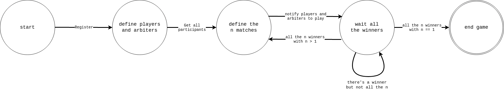
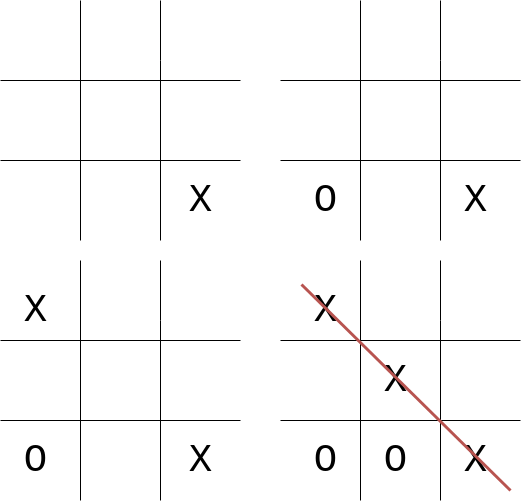

# TicTacToeMultiAgentSystem


A multi-agent system where agents compete in tic-tac-toe tournaments.
The following implementation was made in two different languages:

- **Jade**: Java Agent Development Framework
- **Jason**: A Java-based interpreter for an extended version of AgentSpeak

## Tournament

For each tournament, _3_ different types of agents are created:

- **Master Arbiter**: 1 master arbiter who organizes all the games by choosing the two players and the arbiter who controls the progress of the game. After all the matches of one round, he rearranges the winners so that they can compete against each other until there is only one left;
- **Arbiter**: if $N$ is the number of players, at least $\frac{N}{2}$ Arbiters must be defined. At each turn they check whether or not there is a winner in their game, if so they notify the Master Arbiter, if not, they continue the game. If there is a tie, they repeat the game;
- **Player**: the number $N$ of players must be a power of two in order to have an even number of players for each round and pairs that can always be built. We can actually define two different types of Players:
  - **Stupid Player**: chooses the move randomly;
  - **Intelligent Player**: if he has the chance to win he catches it and if he succeeds he avoids making the opponent win. If he is the first to make the move, he always chooses a corner, otherwise the central cell.

## State Transition Systems

### Master Arbiter



## Game examples

### JADE: 1


A game between a Stupid player and an intelligent player.
Intelligent player starts the game with symbol X and Stupid player with the symbol O.
The following are the _configurations_ in between the game:



### JADE: 2 (Terminal Only)

```bash
Jul 18, 2022 12:17:20 PM jade.core.Runtime beginContainer
INFO: ----------------------------------
    This is JADE 4.5.0 - revision 6825 of 23-05-2017 10:06:04
    downloaded in Open Source, under LGPL restrictions,
    at http://jade.tilab.com/
----------------------------------------
Jul 18, 2022 12:17:20 PM jade.imtp.leap.LEAPIMTPManager initialize
INFO: Listening for intra-platform commands on address:
- jicp://192.168.1.145:1099

Jul 18, 2022 12:17:20 PM jade.core.BaseService init
INFO: Service jade.core.management.AgentManagement initialized
Jul 18, 2022 12:17:20 PM jade.core.BaseService init
INFO: Service jade.core.messaging.Messaging initialized
Jul 18, 2022 12:17:20 PM jade.core.BaseService init
INFO: Service jade.core.resource.ResourceManagement initialized
Jul 18, 2022 12:17:20 PM jade.core.BaseService init
INFO: Service jade.core.mobility.AgentMobility initialized
Jul 18, 2022 12:17:20 PM jade.core.BaseService init
INFO: Service jade.core.event.Notification initialized
Jul 18, 2022 12:17:20 PM jade.mtp.http.HTTPServer <init>
INFO: HTTP-MTP Using XML parser com.sun.org.apache.xerces.internal.jaxp.SAXParserImpl$JAXPSAXParser
Jul 18, 2022 12:17:20 PM jade.core.messaging.MessagingService boot
INFO: MTP addresses:
http://localhost:7778/acc
Jul 18, 2022 12:17:20 PM jade.core.AgentContainerImpl joinPlatform
INFO: --------------------------------------
Agent container Main-Container@192.168.1.145 is ready.
--------------------------------------------
player intelligentPlayer@192.168.1.145:1099/JADE registered in DF.
player stupidPlayer@192.168.1.145:1099/JADE registered in DF.
arbiter arbiter@192.168.1.145:1099/JADE registered in DF.
master-arbiter masterArbiter@192.168.1.145:1099/JADE registered in DF.
HO TROVATO I SEGUENTI ARBITRI:
arbiter@192.168.1.145:1099/JADE
HO TROVATO I SEGUENTI GIOCATORI:
stupidPlayer@192.168.1.145:1099/JADE
intelligentPlayer@192.168.1.145:1099/JADE
Assegno i giocatori e gli arbitri per il round: 0
Agent intelligentPlayer@192.168.1.145:1099/JADE gioca contro stupidPlayer@192.168.1.145:1099/JADE con l'arbitro arbiter@192.168.1.145:1099/JADE.
Agent stupidPlayer@192.168.1.145:1099/JADE gioca contro intelligentPlayer@192.168.1.145:1099/JADE con l'arbitro arbiter@192.168.1.145:1099/JADE.
Random index: 2
Free cells: [0, 1, 2, 3, 4, 5, 6, 7, 8]
---------
|     X |
|       |
|       |
---------
Agent intelligentPlayer@192.168.1.145:1099/JADE ha ricevuto il messaggio e sta facendo la mossa...
---------
|     X |
|   O   |
|       |
---------
Agent stupidPlayer@192.168.1.145:1099/JADE ha ricevuto il messaggio e sta facendo la mossa...
Random index: 6
Free cells: [0, 1, 3, 5, 6, 7, 8]
---------
|     X |
|   O   |
|     X |
---------
Agent intelligentPlayer@192.168.1.145:1099/JADE ha ricevuto il messaggio e sta facendo la mossa...
---------
|     X |
|   O O |
|     X |
---------
Agent stupidPlayer@192.168.1.145:1099/JADE ha ricevuto il messaggio e sta facendo la mossa...
Random index: 1
Free cells: [0, 1, 3, 6, 7]
---------
|   X X |
|   O O |
|     X |
---------
Agent intelligentPlayer@192.168.1.145:1099/JADE ha ricevuto il messaggio e sta facendo la mossa...
---------
|   X X |
| O O O |
|     X |
---------
intelligentPlayer@192.168.1.145:1099/JADE WIN
Agent intelligentPlayer@192.168.1.145:1099/JADE ha vinto.
Agent stupidPlayer@192.168.1.145:1099/JADE ha ricevuto il messaggio e sta facendo la mossa...
stupidPlayer@192.168.1.145:1099/JADE LOSE
Agent stupidPlayer@192.168.1.145:1099/JADE ha perso.
Fine del gioco!
StupidPlayer Agent stupidPlayer@192.168.1.145:1099/JADE sta terminando.
Master Arbiter Agent masterArbiter@192.168.1.145:1099/JADE sta terminando.
IntelligentPlayer Agent intelligentPlayer@192.168.1.145:1099/JADE sta terminando.
Arbiter Agent arbiter@192.168.1.145:1099/JADE sta terminando.
GAME OVER. VINCITORE: intelligentPlayer@192.168.1.145:1099/JADE
```

### JASON: 1


## Contributors

<a href="https://github.com/LorenzoSciandra/TicTacToeMultiAgentSystem/graphs/contributors">
  
</a>
